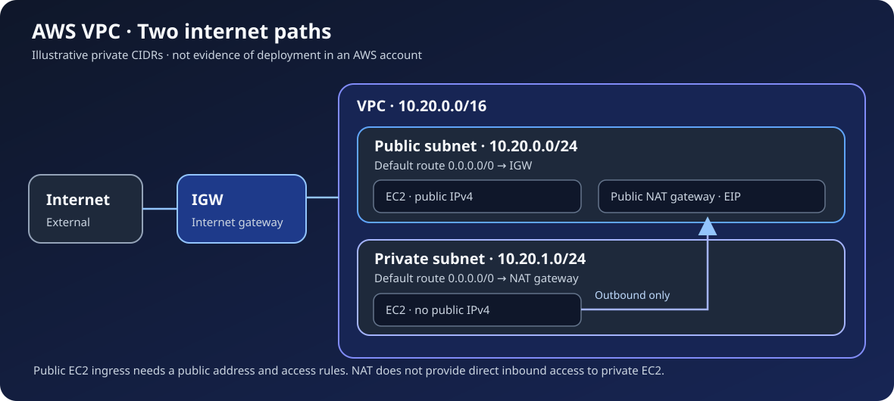

# AWS VPC 네트워킹 구성과 점검

사용자 정의 VPC에서 공개·비공개 서브넷, 라우팅 테이블, 인터넷 게이트웨이, 공개 NAT 게이트웨이와 EC2의 연결을 설명하는 구성 문서입니다. 콘솔에서 확인할 항목과 리소스 의존 관계를 정리했으며, 배포 템플릿이나 실제 AWS 계정의 실행 결과는 포함하지 않습니다.

## 논리 구성

| 구성 요소 | 예시 역할 |
|---|---|
| VPC | `10.20.0.0/16` 사설 주소 공간 |
| 공개 서브넷 | `10.20.0.0/24`; `0.0.0.0/0 → 인터넷 게이트웨이` 경로 |
| 비공개 서브넷 | `10.20.1.0/24`; `0.0.0.0/0 → 공개 NAT 게이트웨이` 경로 |
| EC2 | 공개 서브넷의 웹 인스턴스와 공인 IPv4가 없는 비공개 인스턴스 |

위 CIDR은 **설명용 예시**이며 대상 계정의 리소스나 주소가 아닙니다. 인터넷 방향 경로와 공인 IPv4, 필요한 보안 그룹 규칙을 각각 확인해야 공개 EC2에 외부에서 접근할 수 있습니다. 비공개 EC2는 예시에서 NAT를 통해 외부로 나가지만 NAT만으로 외부의 직접 인바운드 접근을 허용하지 않습니다. [VPC 구성과 점검](docs/vpc-lab.md)에서 단계별 의존성과 검증 기준을 설명합니다.

## 구성 시 확인

1. 공개·비공개 서브넷의 라우팅 테이블과 연결 대상을 비교합니다.
2. 공개 EC2의 공인 IPv4와 제한된 인바운드 규칙, 비공개 EC2의 공인 IPv4 미할당 상태를 확인합니다.
3. 비공개 서브넷의 외부 연결에는 NAT 상태와 공개 서브넷의 인터넷 경로가 모두 필요한지 점검합니다.
4. 정리할 때 EC2, NAT 게이트웨이·탄력적 IP, 라우팅 및 VPC의 의존성을 확인합니다.

이 문서는 **구성·검증 절차**이며 성공 로그나 현재 계정의 배포 증거가 아닙니다. 예시의 공개 NAT 게이트웨이 하나를 여러 가용 영역에서 공유하면 해당 NAT가 속한 영역의 장애가 다른 영역의 외부 연결에도 영향을 줄 수 있습니다. 현재 AWS에는 [Regional NAT 게이트웨이](https://docs.aws.amazon.com/vpc/latest/userguide/nat-gateways-regional.html)도 있으므로 실제 구성에서는 서비스 옵션, 요금과 복원력 요구사항을 별도로 결정합니다. 계정 ID, 실제 공인 IP, 자격 증명은 저장소에 포함하지 않습니다.
